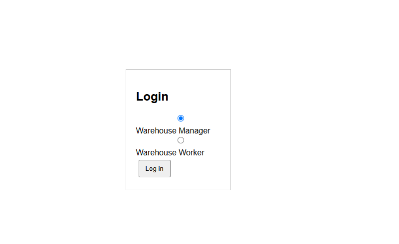
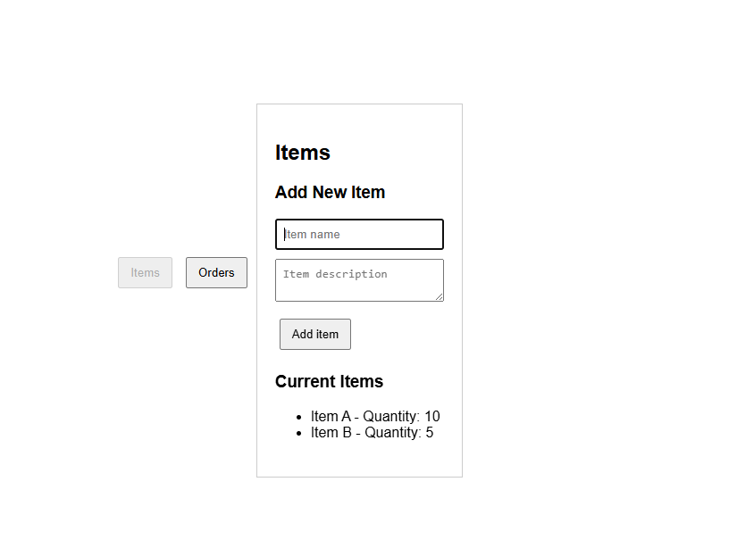
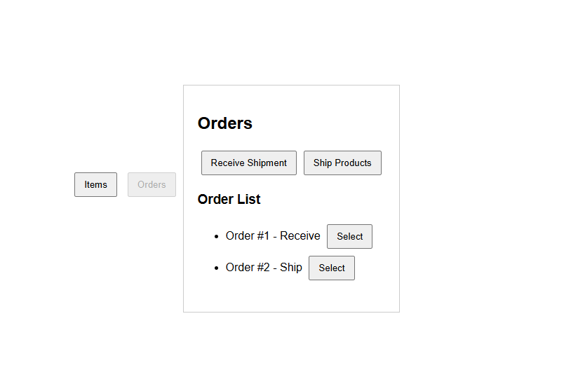
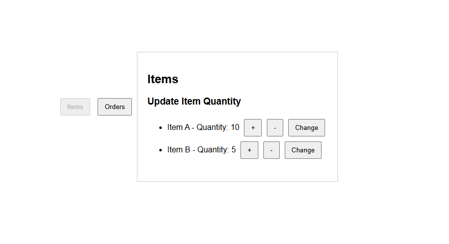

# Project phase 1 - Definition and planning

| **Environment** | **Backend** | **Frontend** | **Database** |
| :--- | :----: | :----: | :----: |
| Azure | Node.js with Express | React | PostgreSQL from Azure |

## 1. User Personas

## 2. Use Cases and User Flows

1. User: Warehouse manager
   Goal: Add new item to the warehouse management system
   User flow: Log in --> Move to "Items" scene --> Click "Add item" --> Fill the information/description for the item --> Add the item to the system database.

2. User: Warehouse worker
   Goal: Adjust/update the quantity of items in system
   User flow: User logs in --> Move to "Items" scene ---> On the list of items, choose the wanted item --> use button +/- to add single item on click or press "change" to set a custom value.

3. User: Warehouse worker
   Goal: Receive/ship items
   User flow: User logs in --> Move to "Orders" scene ---> Choose "Receive shipment" or "Ship products"--> choose the wanted item and their quantities what was received or shipped to keep system on track of items --> use button +/- to add single item on click or press "change" to set a custom value --> review changes --> Save changes.

## 3. UI Prototypes

Start scenario --> choose role Warehouse manager/ regular worker

Add items as warehouse manager

Orders section --> choose to receive or ship products

Update item quantities as worker with +/- or "change" button to set custom value

## 4. Information Architecture and Technical Design

System will be hosted in Azure, where azure databases are also provided. Database will be Azure database for PostgreSQL.
Frontend side is and will be implemented with react. I'm using the knowledge I learned along the advanced web development course to use react to split the functionalities into different components, making it easier to develop and manage them.

Backend side will be worked later on, and it will be done using Node.js along express. This backend solution will make it easier to integrate backend with frontend and also develope the system further.

On this early UI prototype, it is just an basic login functionality. I have a vision, that later on there will be authentication on login, and logged in as "Warehouse manager" you have a section to register new employees as warehouse workers with login credentials.

This early UI prototype also focused more on the functionalities, and later on the UI will be developed further and I will look into optimizing and making the application responsive.

## 5. Project Management and User Testing

Project management will be done with trello, I am familiar with trello from earlier courses so I favor it as Project management platform.
Trello link: https://trello.com/b/9BNIBnDm/aweb

System/User testing will be started when Basic strucutres and main functionalities have been implemented. User tests are done with the warehouse staff. I will personally test alongside developing the system, and User tests would ideally be placed after every phase, look the following table:

| **Basic structure/main functionalities** | **Advanced features** | **Optimization** |
| :--- | :----: | :----: |
|Test 1| Test 2 | Test 3 |
