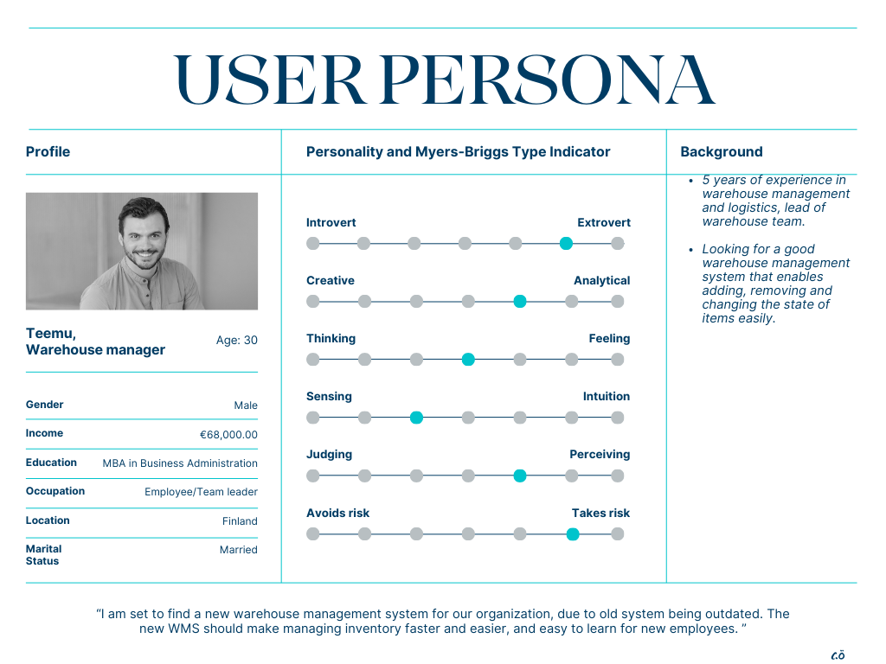
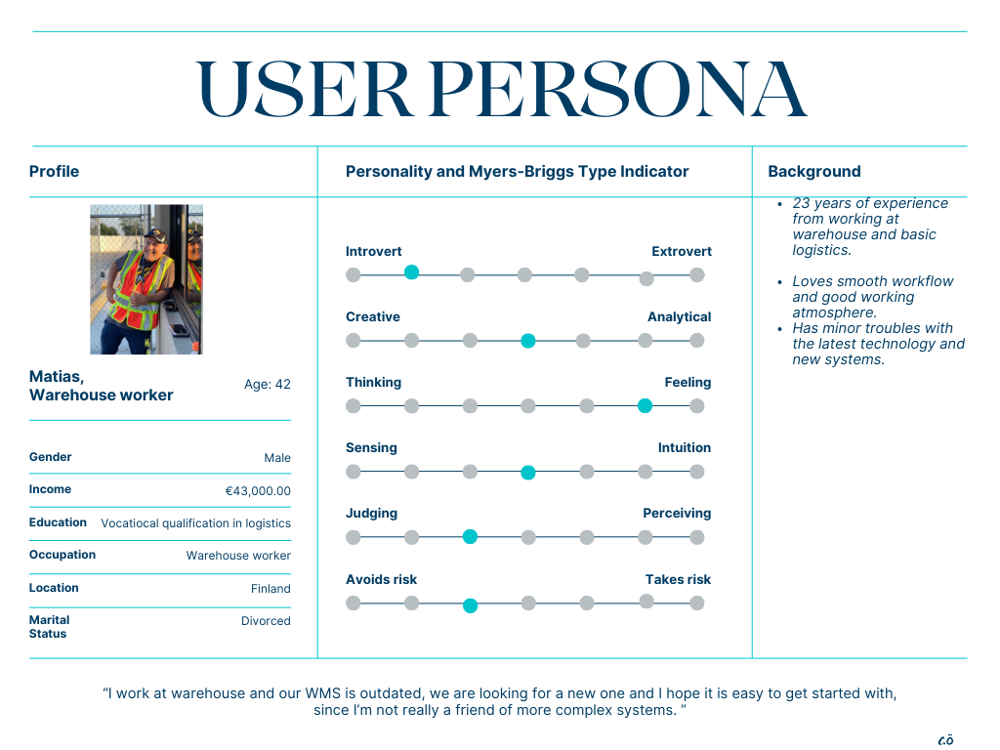

# Project phase 1 - Definition and planning

| **Environment** | **Backend** | **Frontend** | **Database** |
| :--- | :----: | :----: | :----: |
| Azure | Node.js with Express | React | PostgreSQL from Azure |

## 1. User Personas

## 2. Use Cases and User Flows

1. User: Warehouse manager
   Goal: Add new item to the warehouse management system
   User flow: Log in --> Move to "Items" scene --> Click "Add item" --> Fill the information/description for the item --> Add the item to the system database.

2. User: Warehouse worker
   Goal: Adjust/update the quantity of items in system
   User flow: User logs in --> Move to "Items" scene ---> On the list of items, choose the wanted item --> use button +/- to add single item on click or press "change" to set a custom value.

3. User: Warehouse worker
   Goal: Receive/ship items
   User flow: User logs in --> Move to "Orders" scene ---> Choose "Receive shipment" or "Ship products"--> choose the wanted item and their quantities what was received or shipped to keep system on track of items --> use button +/- to add single item on click or press "change" to set a custom value --> review changes --> Save changes.

## 3. UI Prototypes

Add something

## 4. Information Architecture and Technical Design

Add something

## 5. Project Management and User Testing

Add something
