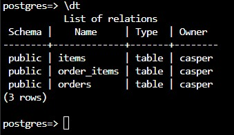
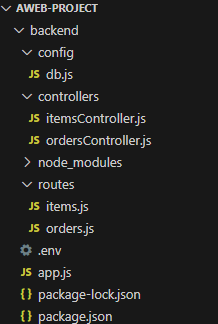
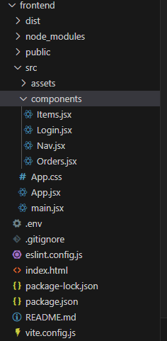
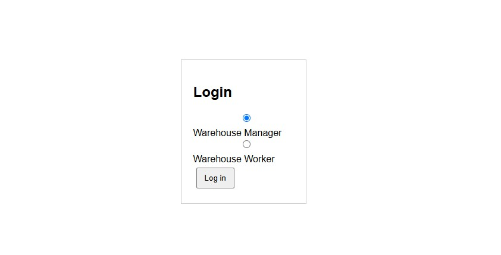
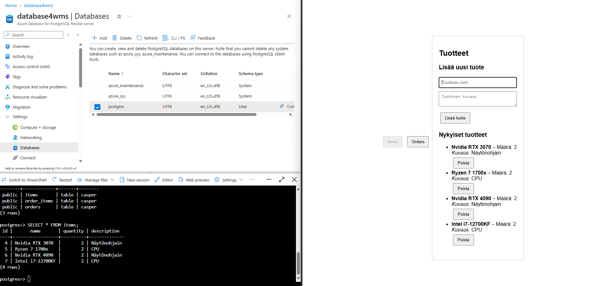
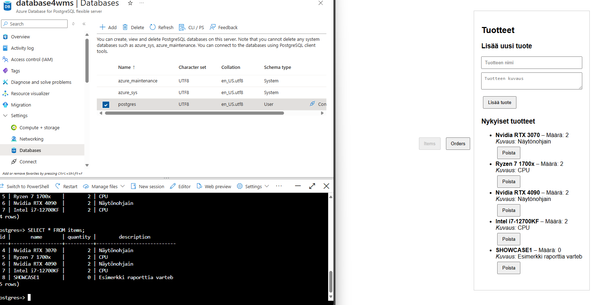
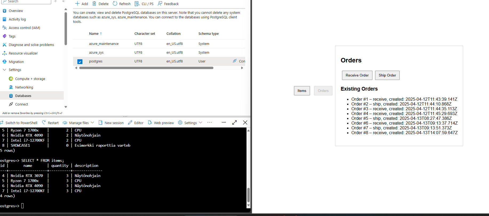
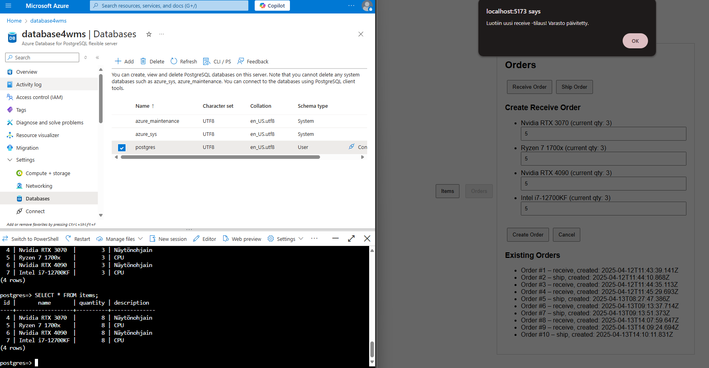
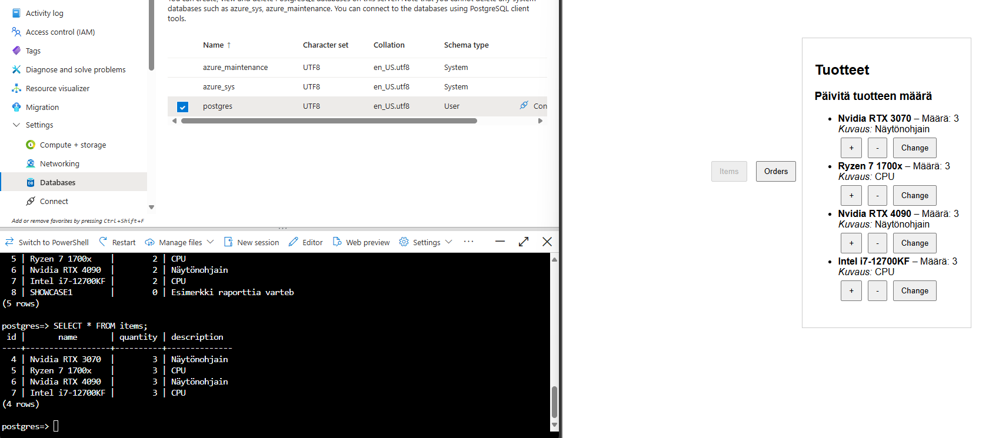

# Project phase 2 - Basic structure and main functionalities

Project's subject is Warehouse management system with basic structure that covers both backend and frontend main features. Server- and client side are implemented separately and database is from Azure PostgreSQL.
On this phase I focused on every aspect, including making improvements on frontend, developing backend and creating Database with Azure PostgreSQL server.

## 1. Environment

Project's backend is implemented with Node.js + Express, and a React based frontend. To enhance the development process, I also used npm for dependency management and nodemon to automatically restart server, after making changes to code. Idea was also to run this whole application from azure. I created azure static web app for frontend, and Azure web app for backend. I encountered some issues with connecting the database to the backend on azure. This is why I have to forget hosting the application on azure for now, but If i have time I might relook into it on Project's phase 3. However, the application worked well locally and the integrating frontend + backend. Backend communication with the Azure PostgreSQL also worked locally.

## 2. Backend
[Backend-folder](./backend/)
<br>
Backend is built using Node.js + Express, handling RESTful API for products and orders.
Code is separated into different modules for routes (items) & (orders), different controllers (itemsController) & (ordersController).
Also database configuration (db.js) is put in a separate folder.

API operations include:

**Items:**

-Fetching

-Adding

-Updating

-Deleting


**Orders:**

-Receive orders (which directly updates inventory quantities, by increasing the qty of items in the database)

-Ship orders (which directly updates inventory quantities, by decreasing the qty of items in the database)

## 3. Frontend
[Frontend-folder](./frontend/)
<br>
Frontend is implemented with react and divided into components: App, Nav, Login, Items, Orders.
Login component allows users to select their role, manager or worker. (Set on manager role as default)
Interface for roles differs, and it determines their available functionalities:
-Manager can add or delete products from the database, and also create new orders ship/receive, which adjusts the qty of items in the database.
-Warehouse worker can update the quantity of the items in the database, and also create new orders.

Axios is used to make asynchronous requests to the backend.
## 4. Database

  

Project uses Azure PostgreSQL db that has three tables:

-items: contains details such as name, quantity and description.

-orders: Stores order details: order type, creation time.

-order_items: join table that links orders to their products by product ID and quantities.


Table structure allows dynamic updates of stock quantities of the items when orders are placed:

-Shipping: Quantity of products from the stock (items) decrease by the amount of specific products shipped.

-Receiving: Quantity of products from the stock (items) increase by the amount of specific products received.

## 5. Basic structure and architecture

Architecture is modular with clear separation into backend, frontend and database layer.
On backend routes, controllers and the database connection are split into separate folders which improves maintainability and keeps the structure as clear as possible.
On frontend, Usaed React-type of approach: components, where different views (login, items, orders) are separate. This makes developing and extending the UI easier.


  




## 6. Functionalities

Select role --> affects the UI functionalities

User roles:

Warehouse manager: can add new products, delete existing products and view product details

Warehouse worker: can update quantities of existing items

Order management
- Full CRUD functionality allows to ADD, DELETE and fetch product details. 
- Both roles are allowed to create new orders where order type receive/ship determines whether the inventory quantity is increased or decreased.
  
API calls are handled with axios, allowing updating the quantities directly from the UI. All adjustments update immediately in real time to the database (Azure postgreSQL).
<br>
<br>

  
**Starting screen, where role is selected.**
```
//Login.jsx:
// Roolin valinta, käyttäjä valitsee manager/worker
function Login({ onLogin }) {
  //oletus rooli manager
  const [role, setRole] = useState('manager');
  
  // Kutsutaan onLogin(role), kun lomake lähetetään
  const handleSubmit = (e) => {
    e.preventDefault();
    onLogin(role);
  };
```
<br>
<br>

 
**Warehouse manager view, can add and delete items.**
```
//Items.jsx:
// Warehouse Manager: lisää uuden tuotteen backendin POST-pyynnöllä
 const handleAddItem = async () => {
    if (!newItemName) return; // Jos tuotteen nimi on tyhjä, ei tehdä mitään
    try {
      // Lähetetään POST. (nimi, määrä ja kuvaus)
      const response = await axios.post('http://localhost:3001/api/items', {
        name: newItemName,
        quantity: 0,
        description: newItemDesc,
      });
      console.log('POST response:', response.data);
      // Lisätään uusi tuote tilaan, jolloin UI päivittyy
      setItems([...items, response.data]);
      setNewItemName('');
      setNewItemDesc('');
    } catch (error) {
      console.error('Virhe tuotetta lisättäessä:', error);
    }
  };
// Warehouse Manager: poistaa tuotteen backendin DELETE-pyynnöllä
  const deleteItem = async (id) => {
    try {
      const response = await axios.delete(`http://localhost:3001/api/items/${id}`);
      console.log('DELETE response:', response.data);
      // Poistetaan tuote tilasta niin, että UI päivittyy
      setItems(items.filter(item => item.id !== id));
    } catch (error) {
      console.error('Virhe tuotteen poistamisessa:', error);
    }
  };
```
<br>
<br>

 
**Warehouse manager added new item into the inventory --> immediately updated into the database.**

<br>
<br>

  
**Orders -main page choose whether to receive or ship/orders. You also see the order history.**

<br>
<br>

  
**Placing "Receive" -order, database immediately updates the quantity of items.**

<br>
<br>

  
**Worker can adjust the quantity of items in database. "Change" -button to set custom quantities**
```
 // Warehouse Worker: muuttaa tuotteen määrää
  const adjustQuantity = async (id, delta) => {
    // Etsitään tuote, jota halutaan muuttaa
    const item = items.find(item => item.id === id);
    if (!item) return;
    const updatedQuantity = item.quantity + delta;
    try {
      const response = await axios.put(`http://localhost:3001/api/items/${id}`, {
        quantity: updatedQuantity,
      });
      // Päivitetään tila korvaamalla muokattu tuote
      const updatedItems = items.map(item =>
        item.id === id ? response.data : item
      );
      setItems(updatedItems);
    } catch (error) {
      console.error('Virhe määrän päivityksessä:', error);
    }
  };

// Warehouse Worker: muuttaa tuotteen määrää suoraan syötteellä
  const changeQuantity = async (id) => {
    const newQty = parseInt(prompt('Anna uusi määrä:'), 10);
    if (isNaN(newQty)) return; // Jos syöte ei ole numero, ei tehdä mitään
    try {
      const response = await axios.put(`http://localhost:3001/api/items/${id}`, {
        quantity: newQty,
      });
      // päivitetään local lista
      const updatedItems = items.map(item =>
        item.id === id ? response.data : item
      );
      setItems(updatedItems);
    } catch (error) {
      console.error('Virhe määrän muuttamisessa:', error);
    }
  };
```

## 7. Code quality and documentation

- Code is organized clear manner, making it easier to extend in the future. 
- Each module in backend (routes, controllers) and React components in frontend are commented and have clear names for functions.
- 
## 8. Testing and error handling

During development I did manual testing. For example for the API endpoints with curl. In the backend try/catch blocks are used for error handling. Errors are logged and then passed to error handling middleware.
In the future automated tests could be done with Cypress, since I've got some experience on software testing course with it.

**Example from "itemsController.js":**
```
// Hae kaikki tuotteet tietokannasta
exports.getAllItems = async (req, res, next) => {
  try {
    const result = await db.query('SELECT * FROM items ORDER BY id');
    res.json(result.rows);
  } catch (error) {
    console.error("Virhe getAllItemsissä:", error);
    next(error);
  }
};
```
In this code snippet, Try block fetches all items from the database, then catch block is for error, if one occurs. Error is then logged with "console.error", then "next(error)" is called so middleware for error handling takes in.


## 9. User interface and interaction

- User interface is still on very early level, but it is pretty straightforward and user-friendly. Login section allows role selection, after which interface adjusts based on whether the user is a manager or a worker.
- Navigation component (Nav.jsx) provides easy switching between "Items" and "orders" -views.
- Both product and order listings include interactive elements that allow for direct adjustments.
- If there is enough time for the optional phase 3, working on enhancing the UI would be one of my top priorities.

## 10. Ideas for phase 3 (If I have enough time, due to the large amount of courses)

- Enhancing and making UI aesthetic
- Try to solve the problem with connecting backend in azure web app to the azure database
- Implement login and user registration (manager could have functionality to register new users with credentials), also use database where user information are stored. bcrypt+JWT token?
