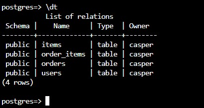
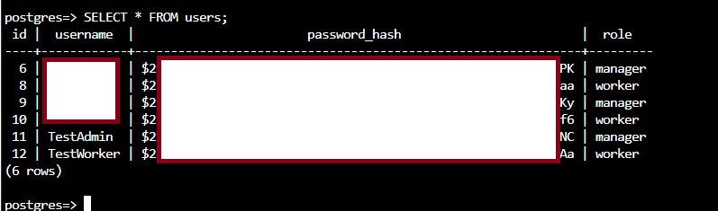

# Phase 4 – Project Presentation

## 🎯 Project title

**Warehouse management system** / **Varastonhallintajärjestelmä**
**Link to the project:** https://red-sky-09c0adf03.6.azurestaticapps.net/
**IMPORTANT!! Test logins for teacher to the application in ItsLearning submission**
## 📝 Project overview

Idea was to implement warehouse management system for basic inventory handling tasks. Target users are warehouse managers and workers, where managers have functionality to add new users such as new employees, by creating login credentials for them to the system. Managers can also add new items to the system with a description. Both roles managers/workers can ship or receive orders, what immediately updates the quantity of items in the system (database table: items;). Warehouse worker's task along receiving and shipping the products, is correcting the quantity of the items in inventory, by adjusting their amount with the (+)/(-) -buttons, or they can use "change" -button to set a custom quantity to update the correct amount to the database.

### Roles in the warehouse management system "Access control"
- Warehouse **manager** --> Think of as an admin (Admin priviledges)
- Warehouse **worker**  --> Think of as an regular employee (basic priviledges)

 

 **Access control table**                                            
| Feature                          | Manager (Admin) | Worker (Regular) |
|----------------------------------|:---------------:|:----------------:|
| **Add new item**                 | Yes             | No               |
| **Delete item**                  | Yes             | No               |
| **Update item quantity**         | No              | Yes              |
| **View all items**               | Yes             | Yes              |
| **Create “Receive” order**       | Yes             | Yes              |
| **Create “Ship” order**          | Yes             | Yes              |
| **View order history**           | Yes             | Yes              |
| **Add users in the system**      | Yes             | No               |
| **Login**                        | Yes             | Yes               |

---

## 📌 Use case summary

[Link to the use cases defined in Phase 1](1_Definition_and_Planning.md)

**Abreviations for the table explained:**
- Phase 1 = (P1): Use cases from phase 1. [1_Definition_and_Planning.md](1_Definition_and_Planning.md)
- Phase 2 = (P2): Use cases / new functionalities added on phase 2. [2_Basic_structure_and_main_functionalities.md](2_Basic_structure_and_main_functionalities.md)
- Phase 3 = (P3): Use cases / new functionalities added on phase 3. [3_Advanced_features_and_optimization.md](3_Advanced_features_and_optimization.md)

   
  
| Use Case | Implemented (Yes/No) | Explanation / Timestamp on video |
|----------|----------------------|------------------------|
| Both roles: Login (P1+P2+P3) | Yes | Role based access: Frontend login form sends credentials to backend API --> login handled in backend where is checked that user's credentials and role matches the bcrypt hash: "password_hash" stored in "users" -table in the database. Timestamp on video: --  |
| Warehouse manager: add new item to the system (P1) | Yes | Backend API route /api/items is used to add new items to system. Implementation and logic for adding new items is in the itemsController.js file. Frontend in Items.jsx includes the creation of the form for manager and when submitting the form, POST request is send to the backend to add new item to the system. Timestamp on video: - |
| Warehouse manager: Delete item from the system (P2)   | Yes | The delete logic is handled in backend, based on item's ID, and item is removed from the items table in database. Timestamp on video: --  |
| Warehouse manager: Register new user to the system (P3)  | Yes | In frontend manager enters new user's details and submitting form sends POST request to backend. In backend POST /api/users/register route registers new user by adding their username, password_hash and role into the database's user table. Timestamp on video: --  |
| Both roles: Receive/ship orders (P1+P2)   | Yes | Both roles can create orders, where "Receiving order" adds the quantity of the items the order includes into the database, and vice versa "Ship order" decreases the amount of items from the system. Frontend send order --> POST request to backend where the process is handled, by updating items table through the order_items table. Timestamp on video: --   |
| Both roles: Cancel order creation (P1+P2)   | Yes | Order creation can be cancelled just by exiting the order -scene, the "cancel" -button in order scene is just more of a "cosmetic" at this point. The logic behind order cancellation is that if the order is interrupted like switching scene, or pressing cancel button, the UI is resetted and order creation data is cleared. Timestamp on video: --  |
| Both roles: View order history | Yes | Frontend makes GET request to /api/orders endpoint and the backend reuturns the list of "existing" or the past orders. Orders.jsx is responsible for displaying the list in frontend for the user. Timestamp on video: -- |
| Both roles: View all items in the system: (P1+P2)  | Yes | When Items component is loaded GET request is made to backend to retrieve and display all items currently in the system. Timestamp on video: --  |
| Warehouse worker: Update quantity of items (P1) | Yes | Warehouse workers can modify the quantity of items with (+)/(-) -buttons, or with the "change" -button to set custom quantity. Timestamp on video: --  |

## ✍️ Technical implementation

### Environment
- Totally hosted in azure:
  -Database: Azure postgreSQL
  -Backend: Azure web app
  -Frontend: Azure static web app
  - npm for dependency management
  - nodemon to automatically restart server after making changes to code
### Frontend
- React used to build the frontend application, using component-based architecture
- Component-based architecture makes it easy to reuse and develope further components
- Axios used to make requests from frontend to backend. (Retrieving and sending data)
[Frontend folder](./frontend)
**Frontend static web app hosted separately at:** https://red-sky-09c0adf03.6.azurestaticapps.net
### Backend 
- Backend is built using Node.js and Express, for building RESTful APIs.
- Handles HTTP requests and routes them to the controllers in backend.
- Backend uses Azure PostgreSQL as the database, and their connection is made with the pg-promise library.
- Bcrypt for password hashing, for example when manager registers user password is hashed before storing it in the database.
- For the project 4 tables are used in the database:
  -items: contains details such as name, quantity and description.
  -orders: Stores order details: order type, creation time.
  -order_items: join table that links orders to their products by product ID and quantities.
  -users: Stores User ID, username, password_hash and role.
 [Backend folder](./backend)
**Backend web app hosted separately at:** casperwms-gbedepega8afhhft.canadacentral-01.azurewebsites.net
   

  **Picture of the tables in database**

  
  
   

**Picture of the users table**

## 🚂 Development process

---
1. Working with defining the project idea and planning
   - Environment: Azure
   - Backend: Node.js with Express
   - Frontend: React
   - Database: Azure Postgresql
   - Making user personas and coming up with use cases and user flows.
   - Worked on frontend, to make UI prototypes
[1_Definition_and_Planning.md](1_Definition_and_Planning.md)

 

2. Main functionalities
   - Warehouse manager: View, add, delete items
   - Warehouse worker: update quantities of existing items
   - Both roles can create new orders ship/receive
   - Testing and error handling
[2_Basic_structure_and_main_functionalities.md](2_Basic_structure_and_main_functionalities.md)

 

3. Extra features or improvements (optional)
   - Host application in azure environment (failed on phase 2, only local implementation there)
   - Implemented functionality for manager -role to register new employees into the system
   - Login (with authentication)

## ☀️ Reflection and future work

### Reflection & Issues encountered
- Project took plenty of time, and had some setbacks and problems, which made me feel miserable and frustrated.
- Hardest part was working with the backend, and making backend and frontend "communicate".
- Biggest frustration was AZURE
- Succeeding on hard parts gave more motivation and energy to push through:
  - Problems connecting azure postgresql to azure web app (backend), issue with connection string = Solved this by following outputs from azure web app (backend) log stream.
  - Issue encountered with bcrypt and azure compatibility, fixed with updating json packages in github.

### Future work ideas
- Working on UI, to make it more user-friendly and aesthetic.
- Possibly integrating JWT to enhance security and scalability.

## 📊 Work Hours Log
[Link to original project logbook](logbook.md)
# Project logbook

| Date  | Used hours | Subject(s) |  outcome |
| :---  |     :---:      |     :---:      |     :---:      |
| 10.3.2025 | 1 | Creating new branch (oprhan) for final project to avoid possible conflicts + adding template files for project phases  | Base template environment for final project in github  |
| 20.3.2025 | 2 | Planning the implementation and environment for warehouse management system   | Environment: azure, Backend: Node.js with express, Frontend: React, Database: Azure PostgreSQL  |
| 21.3.2025 | 5 | Finishing phase 1: Definition and planning  | User personas, use cases/user flows, UI prototypes, information architecture and technical design, project management + user testing  |
| 11.4.2025 | 2 | Backend | Crude for backend |
| 12.4.2025 | 5 | Backend + DB azure postgreSQL  | Backend crude + Azure postgreSQL DB creation. Integrating Frontend + backend + Azure DB  |
| 12.4.2025 | 4 | Frontend + backend + azure postgresql | Created more tables to store order information. Implemented functionality for "Warehouse manager" -role to delete added items. Updated the UI for both roles to display item description under item. Worked on the orders idea to create functionalities to receive/ship orders. Receiving/shipping certain amount of items updates the quantity of items in storage (+-) directly into the Azure PostgreSQL-db. Working on the orders part took the most time.|
| 13.4.2025 | 9 | Refining the code + Azure host + Writing the report  | Refined the code, tried to move the application completely to azure. Backend on azure web app (success), Frontend on azure static web app (success), but encountered issues with connecting the database to the backend on azure web app. Felt like wasted hours, but I believe if I have time to work on optional phase 3 I might get it to work. I felt like I was running out of time today.  |
| 23.4.2025 | 3 | Worked on fixing the integration problem with azure db (postgresql), frontend(azure static web app) and backend (azure web app). Had to also do minor testing w/ dev tools to identify the issues.  | Successfully integrated backend+frontend and db  |
| 23.4.2025 | 6 | Implementing login functionalities for the wms using bcrypt  | pushed into azure, had some problems again with azure and bcrypt dependecies but finally got it to work and hope it keeps working. |
| 24.4.2025 | 2 | Phase 3 (optional) report  | Finished phase 3 report  |
| 26.4.2025 | 4 | Writing phase 4 report  | Gathered previous work information into a presentation with a plan. Next step is to tomorrow record the presentation itself |
| x | x | x  | x  |

| **Total**  | **43h** |                                 |

## 🪢 Presentation link

_Add a link to your video presentation or state that it was presented live._
